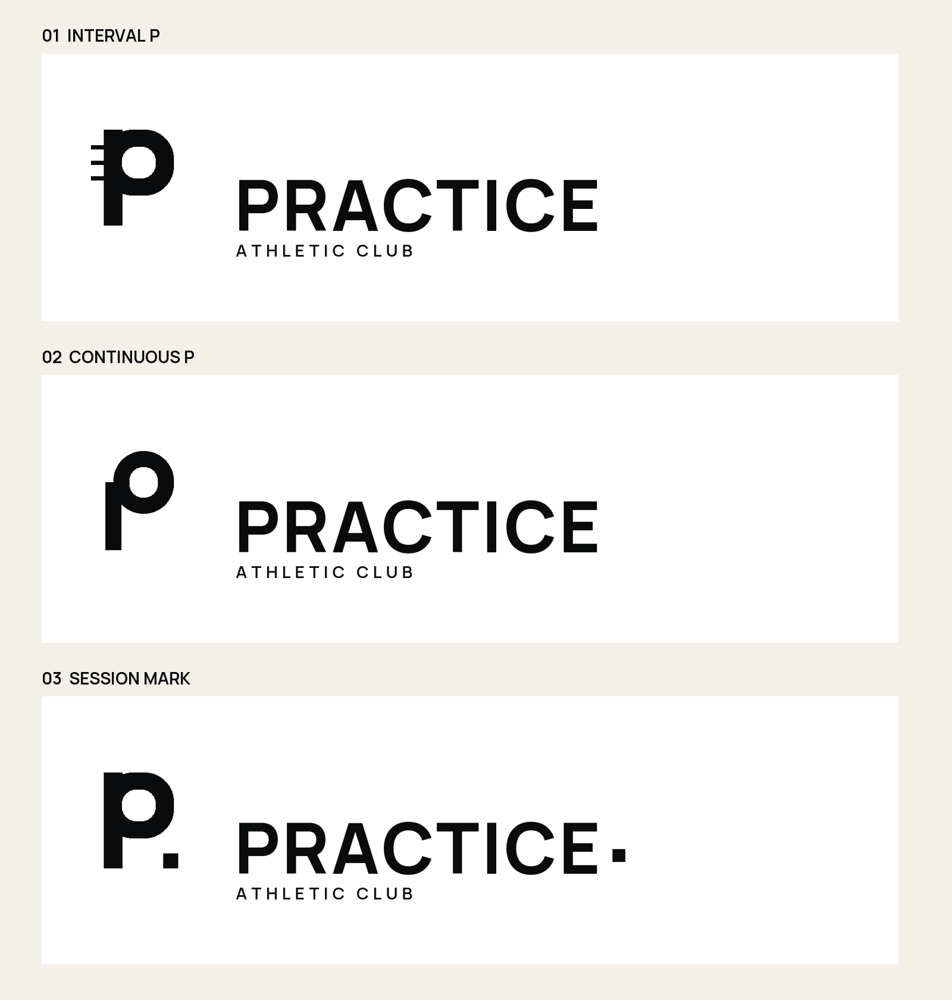
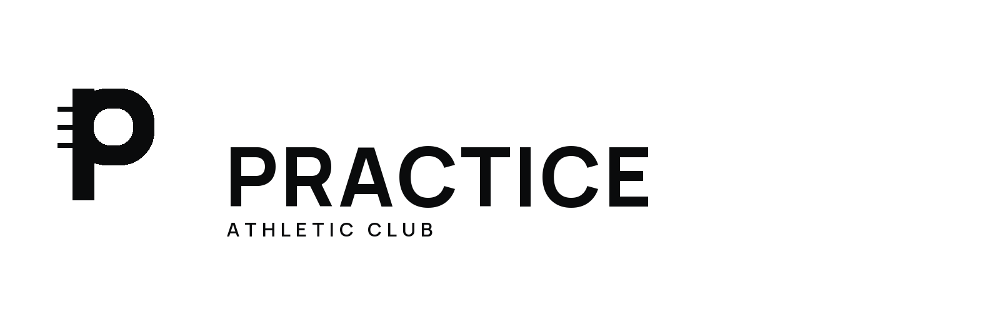
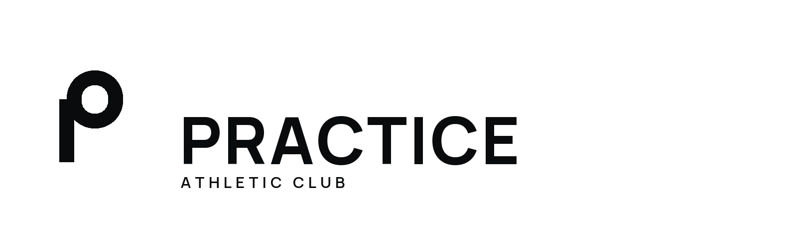
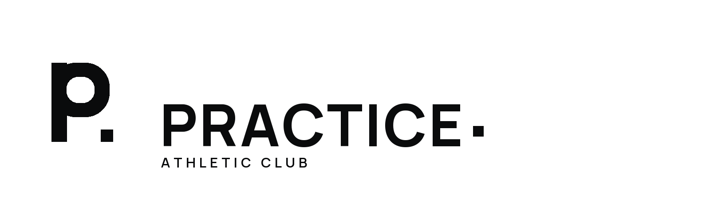
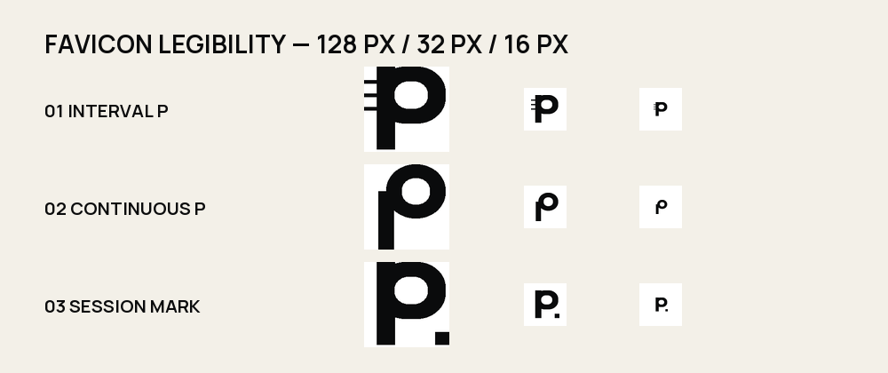

# Practice Athletic Club Monochrome Logo Concepts

## Status

Territory A, **Quiet Strength**, is approved. These logo concepts are a selection set inside that territory; none is the final logo until explicitly selected and refined.

The concepts are intentionally monochrome. A mark that depends on the signal-lime accent to communicate its idea is not strong enough to advance.

## Comparison

## Concept 01 — Interval P

### Idea

A stable uppercase `P` is intersected by three measured entry strokes. The repetition represents sessions, sets, and steady progress without depicting equipment.

### Character

- Precise
- Athletic
- Structured
- Compact
- Recognizable without being aggressive

### Refinement needs

- Optically balance the three interval strokes against the bowl
- Test whether two or three strokes produce the stronger micro mark
- Refine the join so the detail feels rhythmic rather than like speed lines
- Customize the wordmark spacing and selected letterforms after mark approval

## Concept 02 — Continuous P

### Idea

A single continuous construction expresses practice as an ongoing process rather than a finish line.

### Character

- Calm
- Fluid
- Minimal
- Approachable

### Refinement needs

- Resolve the lowercase appearance
- Create a more proprietary relationship between stem and bowl
- Prevent resemblance to generic monoline `P` symbols

## Concept 03 — Session Mark

### Idea

A stable `P` is paired with a square completion mark. The square can become a recurring graphic device for completed sessions and calls to action.

### Character

- Direct
- Modular
- Digital-friendly
- Deliberate

### Refinement needs

- Reduce parking-sign associations
- Decide whether punctuation belongs in the formal name
- Ensure the square remains visible without dominating at small sizes
- Avoid repeating the device so often that it becomes a gimmick

## Favicon evidence

The preview compares the marks at 128, 32, and 16 pixels. This is a visual screening test, not a claim that rasterized previews replace final pixel-grid adjustment.

| Test | 01 Interval P | 02 Continuous P | 03 Session Mark |
| --- | --- | --- | --- |
| 16 px recognition | Strong | Legible but generic | Legible; dot is fragile |
| Monochrome | Pass | Pass | Pass |
| Distinctive silhouette | Strongest | Weak | Medium |
| Quiet Strength fit | Strong | Medium | Medium |
| Primary risk | Speed-line reading | Generic lowercase `p` | Parking/punctuation reading |

## Recommendation

Advance **Concept 01 — Interval P**. It has the clearest connection to repetition, retains its identity at favicon scale, and fits Quiet Strength without relying on a literal gym symbol.

The next pass should refine only Concept 01 into:

- Primary horizontal lockup
- Wordmark-only version
- Compact mark
- Black-on-white and white-on-black variants
- 16, 24, and 32-pixel optical corrections
- Initial clear-space and minimum-size rules

Color should be applied only after the monochrome geometry is approved.

## Source files

Each concept includes an editable SVG lockup and SVG favicon test. PNG files are review previews. Manrope is used as an open-source working typeface; its font file and OFL license are stored with the brand materials. The final wordmark will require optical customization rather than relying on untouched font output.
