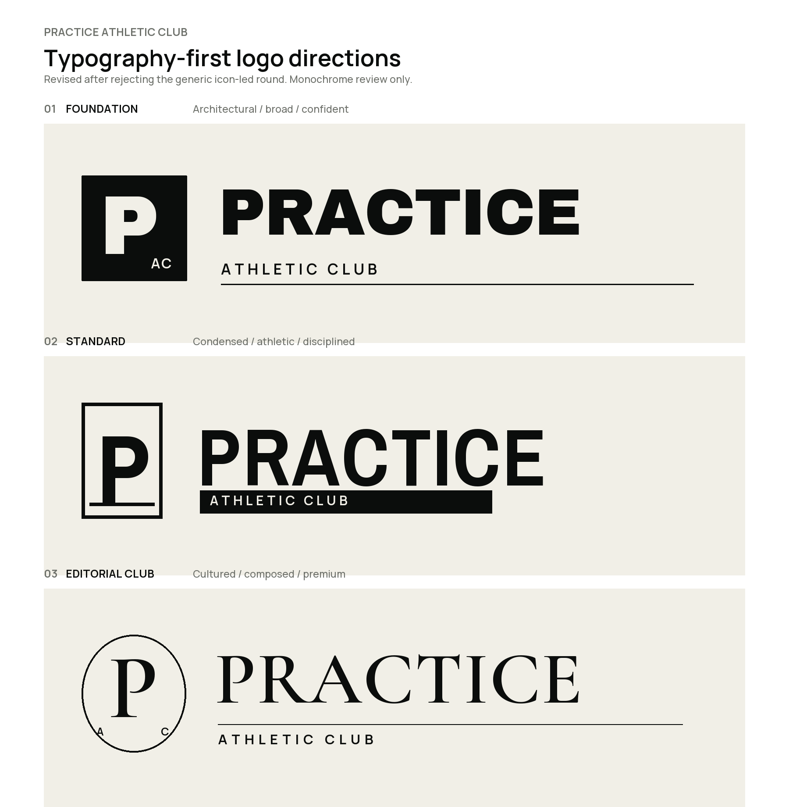
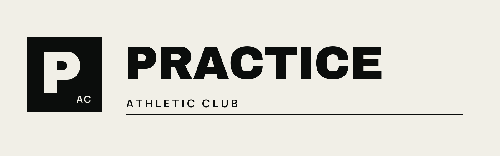
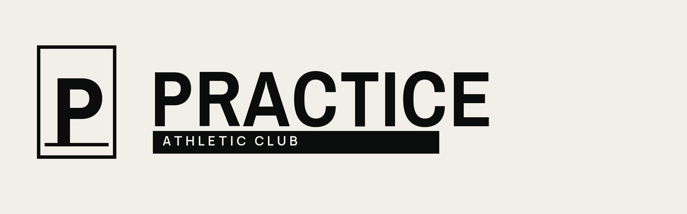
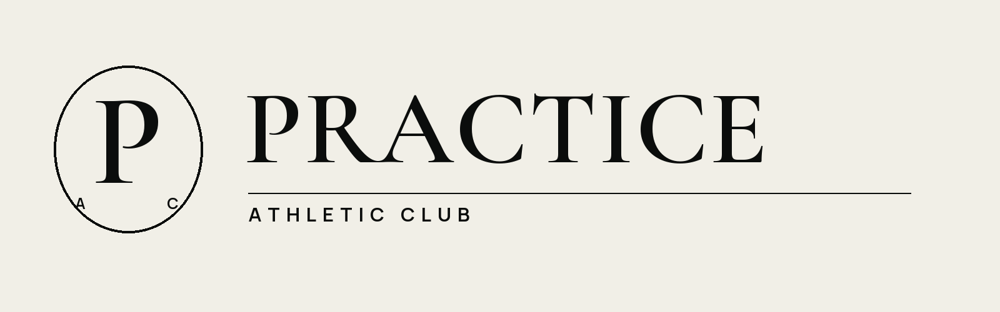
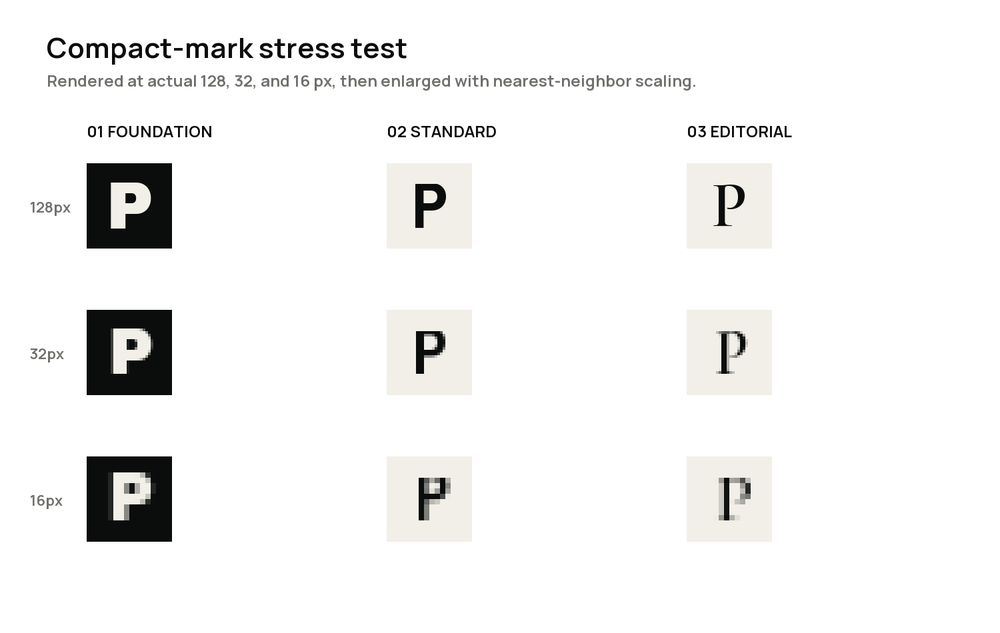

# Practice Athletic Club Typography-First Logo Directions

## Status

Quiet Strength remains the approved visual territory. The first icon-led logo round was rejected on 2026-09-15 because it felt generic, software-like, and insufficiently premium.

This second round starts with the name rather than a symbol. The routes are monochrome and use open-license type sources converted to vector outlines. None is approved yet.

## Revised comparison

## 01 — Foundation

A broad, architectural wordmark intended to feel permanent and confident on a building, training kit, or membership card. The compact `P / AC` field is subordinate to the name.

**Strengths:** immediate, robust, highly legible.

**Risk:** without deeper letter customization it can still feel like a premium apparel label rather than a proprietary club identity.

## 02 — Standard

A condensed athletic wordmark with the descriptor treated as a disciplined utility label. It has the strongest performance character of the set.

**Strengths:** athletic, space-efficient, effective on signage and apparel.

**Risk:** the framed `P` can drift toward institutional or varsity language if overused.

## 03 — Editorial Club

A high-contrast serif wordmark paired with restrained sans-serif information typography. It presents Practice as a contemporary club and cultural space, not only a room of equipment.

**Strengths:** distinctive within fitness, premium, calm, international.

**Risk:** the identity will need forceful photography, direct language, and athletic layout behavior so it never becomes delicate or spa-like.

## Compact-mark evidence

The simple `P` marks were rendered at actual 128, 32, and 16-pixel sizes and enlarged without smoothing for inspection. These are stress tests, not final favicon drawings; the selected mark will receive size-specific optical correction.

## Recommendation

Advance **03 — Editorial Club**.

The premium athletic category is crowded with heavy sans-serif wordmarks and literal performance symbols. The serif route gives Practice a more ownable voice while remaining disciplined. This follows the strategic lesson, not the artwork, of Third Space's documented use of typography atypical to the fitness sector.

If approved, the next pass will refine only this route into:

- A custom PRACTICE wordmark rather than untouched font output
- Primary and compact lockups
- A corrected standalone `P`
- Black-on-bone, bone-on-black, and one-color production variants
- Clear-space and minimum-size rules
- Signage, training-kit, membership-card, and booking-interface context tests

Color remains excluded until the wordmark construction is approved.

## Research references

- [Third Space official site](https://www.thirdspace.london/)
- [Third Space rebrand effectiveness case study](https://effectivedesign.org.uk/sites/default/files/419%20-%20Third%20Space%20Rebrand.pdf)
- [Equinox official site](https://www.equinox.com/)

These sources were used to understand category conventions. No third-party logo artwork was copied or included.

## Source files

Each route has an editable SVG with outlined letterforms and a PNG review preview. The working type sources and SIL Open Font License files are stored under `fonts/` for reproducibility.
