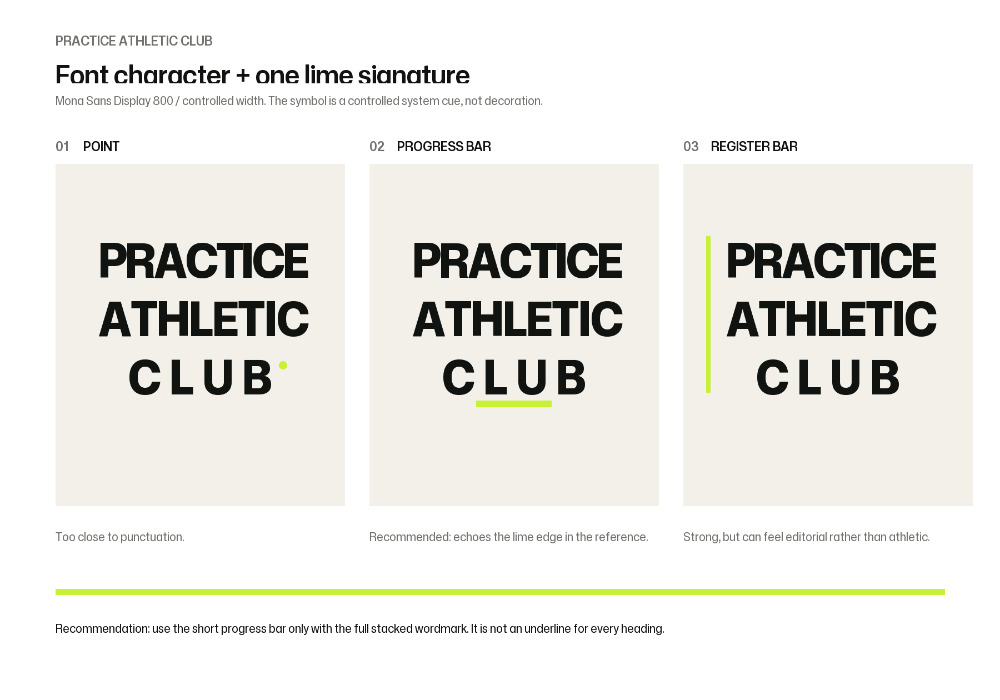

# Practice Athletic Club Mona Sans and Lime Marker Exploration

## Status

This is an unapproved option set created after the user requested a stronger font with one green differentiator. It does not replace the active Instrument Sans custom-wordmark candidate until explicitly selected.

## Font direction

**Mona Sans Display**, weight 800, width 94, and optical size 72 has more industrial character than Instrument Sans while remaining clean and international. It is licensed under the SIL Open Font License 1.1; the source font and license are stored in `../fonts/mona-sans/` for reproducible review.

## Lime signature options

### 01 — Point

A lime dot following `CLUB`.

**Decision:** reject. It reads as punctuation rather than an owned sign.

### 02 — Progress bar

A short lime bar below `CLUB`, aligned to the stacked composition.

**Recommendation:** advance. It echoes the lime material edge in the supplied reference without becoming an underline applied everywhere.

### 03 — Register bar

A thin lime vertical bar aligned beside the entire lockup.

**Decision:** reserve. It is strong but drifts more editorial than athletic.

## Proposed rule if 02 is selected

Use the short lime progress bar only with the full stacked wordmark, at the same width ratio and placement. It is not a generic underline for page headings, navigation, or body copy.

## Next review gate

Select or reject the Mona Sans plus progress-bar direction. If selected, rebuild the primary, inverse, horizontal, compact, size-test, and Figma-import SVG assets using the approved geometry.
