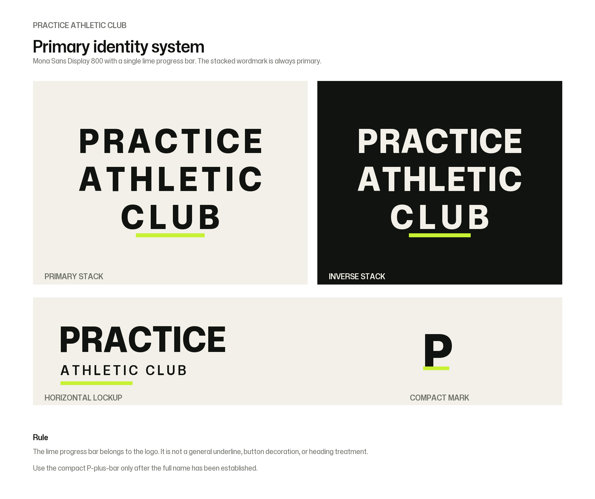
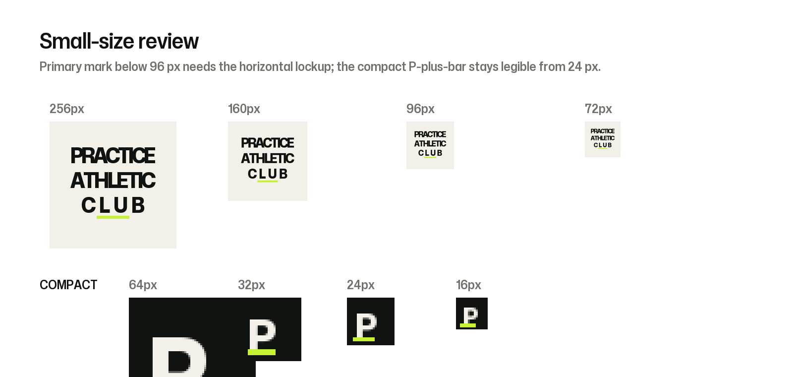
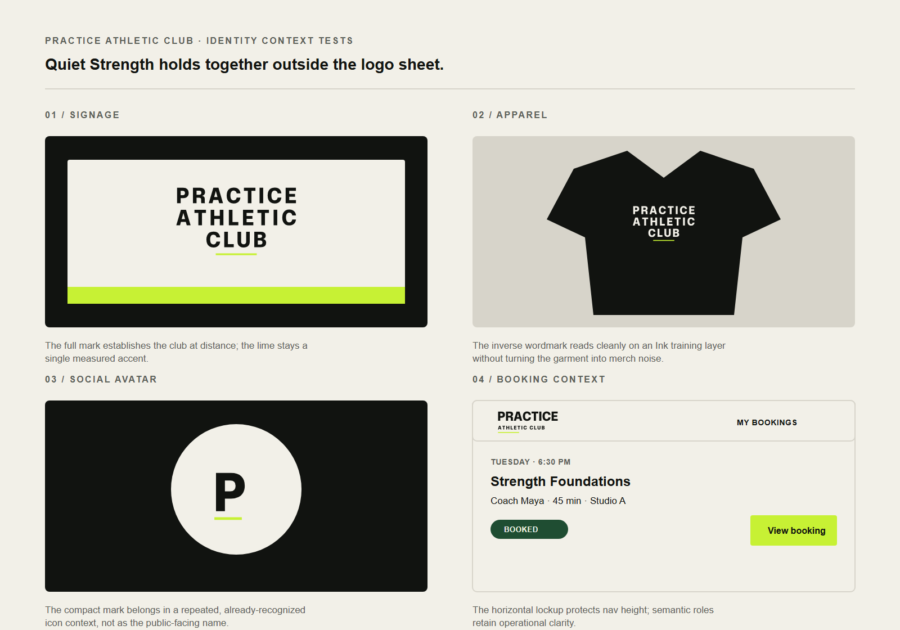

# Practice Athletic Club Logo System

## Status

Working logo direction: **Mona Sans Display 800 with a short lime progress bar beneath `CLUB`**. It is an exploratory candidate, not an approved final logo. Its fit must be evaluated against the eventual positioning through the [brand definition guide](brand-definition-guide.md).

## Core idea

The name is the identity. `PRACTICE / ATHLETIC / CLUB` forms a compact, confident block. The lime bar is a precise measure of progress, not a generic fitness motif or a decorative device to repeat throughout layouts.

## Construction

- Typeface: Mona Sans Display Variable, `wght 800`, `wdth 94`, `opsz 72`
- Uppercase with controlled tracking and a compact three-line rhythm
- `PRACTICE` is visually dominant; `ATHLETIC` and `CLUB` give the name its club context
- Signal bar: `#C7F134`, centered below `CLUB`
- The primary mark uses the full name. It does not need a standalone icon.

The supplied SVG artwork is outlined, so it does not need a font installed when it is placed in Figma, print files, or production artwork. Mona Sans remains the editable family for future brand and interface type rules.

## Variants

- [Primary stacked wordmark](logo/practice-primary-stacked.svg)
- [Inverse stacked wordmark](logo/practice-primary-stacked-inverse.svg)
- [Horizontal lockup](logo/practice-horizontal-lockup.svg)
- [Compact P plus progress bar](logo/practice-compact-mark.svg)

Use the compact mark only in recognized contexts: an app icon, social avatar, favicon, or repeated internal touchpoint. Do not use it as a substitute for establishing the name.

## Color behavior

| Role | Value | Use |
| --- | --- | --- |
| Ink | `#111310` | Primary wordmark on light fields |
| Bone | `#F2F0E8` | Preferred quiet light field |
| Signal lime | `#C7F134` | Progress bar only |

These colors are working choices for the current direction. They are not an approved identity or complete accessible interface palette.

## Clear space and size

- Keep clear space equal to at least **two lime-bar heights** around every edge of the primary and horizontal marks.
- Primary stacked mark: minimum **120 px wide** in digital work. Below that, use the horizontal lockup when the space is wide enough.
- Horizontal lockup: minimum **160 px wide**.
- Compact P plus bar: minimum **24 px wide**. For a 16 px favicon, use a monochrome `P` fallback rather than forcing the bar to remain legible.

## Do not

- Stretch, outline, shadow, rotate, or put the mark inside a badge.
- Rebuild the wordmark by typing it in another font.
- Use lime as body text, a dominant surface, or an arbitrary underline elsewhere in the identity.
- Add dumbbells, shields, wings, flames, or a separate fitness icon to the logo.

## Context validation

Candidate palette and Mona Sans hierarchy are documented in [the color and type system](../color-and-type-system.md). The current mark has been tested in [signage, apparel, social-avatar, and booking-interface contexts](practice-context-tests.svg). This is evaluation material, not a finalized usage system.

## Next review gate

Use the [brand definition guide](brand-definition-guide.md) to establish strategy, then retain, revise, or replace this candidate before preparing final usage rules.
