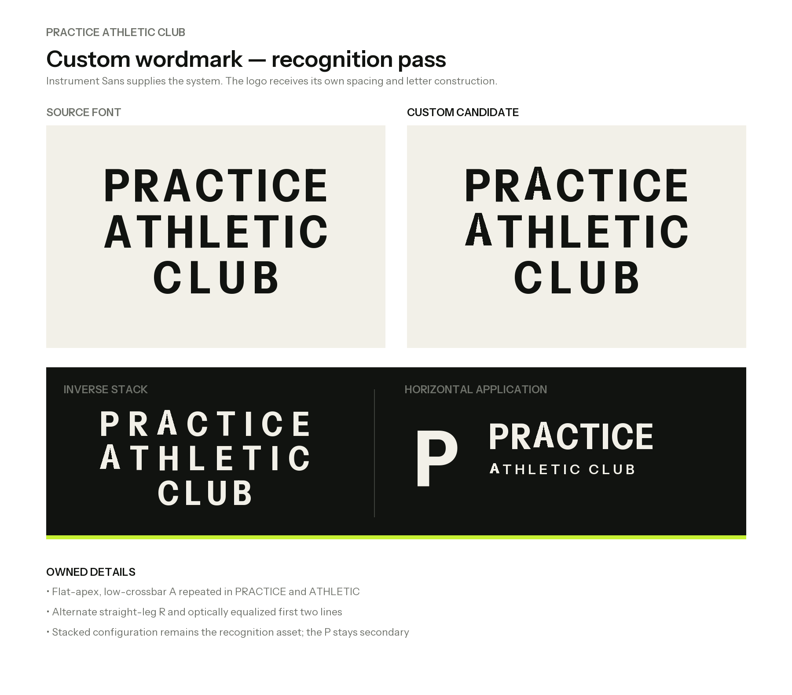

# Practice Athletic Club Reference-Led Wordmark System

## Status

This is the active logo candidate, reconstructed as original vector artwork from the visual direction shown in two user-supplied reference images on 2026-09-15. It is not approved until the user explicitly confirms it.

The references are evidence of intended art direction, not source artwork to trace or instructions embedded in a document.

## Core idea

The name is the identity. `PRACTICE / ATHLETIC / CLUB` forms a compact three-line block with enough authority to work on architecture, apparel, membership materials, and the booking experience.

The standalone `P` is a secondary utility mark. It must appear only where the full name is already understood, such as an app icon, favicon, or repeated environmental detail.

## Construction

- Uppercase geometric sans-serif
- `PRACTICE` and `ATHLETIC` optically equalized in width
- `CLUB` centered beneath the two full-width lines
- Tight vertical rhythm
- Controlled tracking rather than default typesetting
- Working skeleton: Instrument Sans at width 90 and weight 700
- Custom flat-apex, low-crossbar `A` repeated in both full-width lines
- Alternate straight-leg `R`
- Letterforms converted to outlined vector paths

Instrument Sans is the supporting type family, not the finished logo. The custom construction and exact stacked configuration create the identity. The final approval pass may include further optical adjustments to individual glyph spacing. The logo does not depend on a badge, dumbbell, shield, swoosh, or abstract fitness icon.

## Variants

- [Primary stacked wordmark](logo/practice-stacked-wordmark.svg)
- [Inverse stacked wordmark](logo/practice-stacked-wordmark-inverse.svg)
- [Environmental horizontal lockup](logo/practice-horizontal-lockup.svg)
- [Compact P](logo/practice-compact-p.svg)

All SVGs contain outlined letterforms, so they do not require a font installation when imported into Figma or production artwork.

## Working color behavior

- Ink: `#111310`
- Bone: `#F2F0E8`
- Signal lime: `#C7F134`

The lime is a small functional signal, never the primary logo color. These values remain provisional until the dedicated palette review.

## Usage principle

Use the full stacked wordmark by default. Use the horizontal lockup when physical space requires it. Use the compact `P` only after brand recognition has already been established.

Do not add containers, ornaments, gradients, shadows, outlines, or fitness imagery to the wordmark.

## Next review gate

Confirm whether the custom candidate improves recognition while preserving the supplied reference direction. After approval, perform optical refinement, minimum-size testing, clear-space definition, and real-context mockups before moving to color approval.
