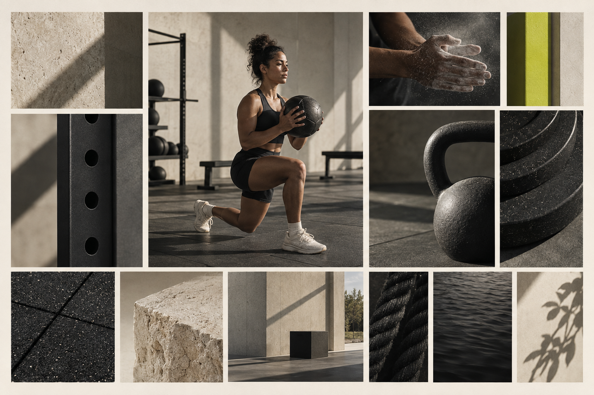
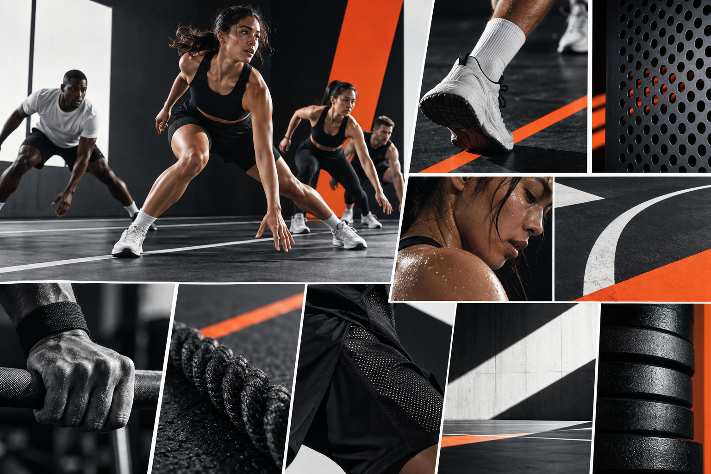
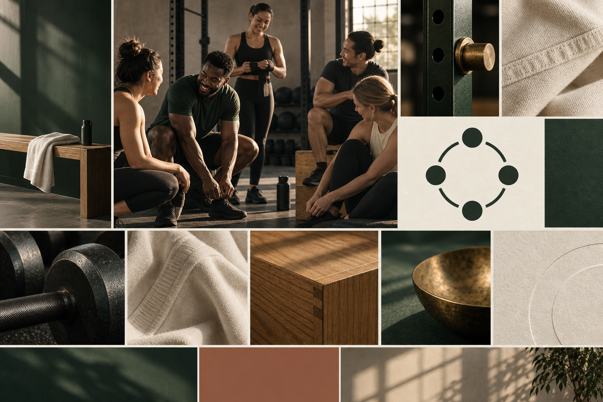

# Practice Athletic Club Visual Territories

## Review status

Territory A, **Quiet Strength**, was approved on 2026-09-15. Territories B and C remain documented as rejected alternatives. The approved territory's palette and typography are still provisional until their dedicated review stages.

The moodboards use original AI-generated imagery for private art-direction exploration. They are not final campaign photographs, proof of a real facility, or approved brand assets.

## Shared requirements

Every viable territory must:

- Present Practice as a gym, never as booking software
- Feel international, premium, disciplined, and welcoming
- Avoid dumbbells, flexing silhouettes, shields, wings, flames, and militaristic motifs as logo shortcuts
- Work in one color and at 16-pixel favicon scale
- Support both energetic public communication and clear booking information
- Use open-source typefaces with licenses recorded before final delivery
- Pass WCAG 2.2 contrast testing after its palette is refined
- Use only fictional, licensed, or commissioned photography in final applications

## Territory A — Quiet Strength

### Core thought

Strength does not need to announce itself. Practice feels focused, architectural, and calm, with one precise signal of energy.

### Visual language

- Warm negative space and disciplined grid alignment
- Matte, tactile surfaces rather than glossy fitness spectacle
- Controlled crops of authentic movement
- Rectilinear forms interrupted by one vivid accent
- Subtle grain and natural directional light

### Candidate palette

| Role | Working value |
| --- | --- |
| Bone canvas | `#F3F0E8` |
| Practice ink | `#171814` |
| Mineral | `#74756F` |
| Chalk | `#FFFFFF` |
| Signal lime | `#C7F23A` |

The lime acts as a signal, not a text color or dominant surface. Exact values remain subject to contrast testing.

### Typography direction

- Display and wordmark exploration: **Manrope Variable**, with custom spacing and letterform modifications
- Reading and functional copy: **Source Sans 3 Variable**
- Character: contemporary, precise, open, and readable without becoming a technology brand

### Logo approach

- A custom `PRACTICE` wordmark with broad, stable proportions
- Compact mark derived from repeated intervals in the letter `P`, expressing practice through rhythm rather than literal gym equipment
- `ATHLETIC CLUB` used as a quiet descriptor, never equal in prominence to `PRACTICE`

### Photography

- Individual concentration, preparation, and controlled exertion
- Real skin, fabric, chalk, and equipment texture
- Directional daylight and believable facilities
- No posed celebrations, artificial sweat effects, or impossible physiques

### Strengths

- Best match for the approved restrained-premium direction
- Distinct from loud commercial gym branding
- Transfers cleanly to signage, apparel, printed material, and digital booking touchpoints

### Risk

If the accent and motion system become too subtle, the identity could feel like architecture or wellness rather than an active gym.

## Territory B — Kinetic Editorial

### Core thought

Every session creates forward motion. Practice feels immediate, rhythmic, and athletic, like a tightly art-directed international sports publication.

### Visual language

- Strong black-and-white contrast
- Asymmetric panels, diagonal crops, and directional rules
- Bold image sequencing that suggests repetition and pace
- Signal color used for booking actions, class categories, and editorial emphasis
- Crisp coated surfaces balanced by human physical texture

### Candidate palette

| Role | Working value |
| --- | --- |
| Cool canvas | `#F5F7F6` |
| Deep black | `#0A0B0C` |
| Steel | `#6B7176` |
| Signal orange | `#FF4F1F` |
| White | `#FFFFFF` |

Signal orange must be paired with tested foreground colors rather than assumed to support white text.

### Typography direction

- Display: **Barlow Condensed**, used in short, forceful headlines
- Body and functional information: **Inter Variable**
- Character: fast, direct, compact, and highly legible

### Logo approach

- Wide uppercase wordmark with custom cuts that imply sequencing and forward movement
- Compact `P` mark formed from offset tracks or repeated frames
- No italic distortion; motion comes from construction and composition

### Photography

- Group classes in active transitional moments
- Tight crops of hands, foot placement, floor markings, and equipment contact
- Harder light, decisive shadow, and occasional direct flash
- Sweat and exertion shown honestly, without aggression

### Strengths

- Most energetic and campaign-ready territory
- Makes classes and scheduling feel active rather than administrative
- Strong recognition potential in social and outdoor applications

### Risk

Without restraint, this can become another black-and-orange high-intensity gym or feel intimidating to new members.

## Territory C — Modern Club

### Core thought

Training is a shared ritual. Practice feels like a place people belong to, combining contemporary performance with understated club heritage.

### Visual language

- Deep green fields, warm paper, and tactile natural materials
- Structured layouts with softened pacing
- Circular gathering motifs without traditional crests
- Quiet material detail: canvas, oak, painted steel, rubber, and restrained metal
- Human interaction before and after exertion

### Candidate palette

| Role | Working value |
| --- | --- |
| Warm ivory | `#F2EBDD` |
| Practice green | `#12372A` |
| Charcoal | `#222521` |
| Muted clay | `#B66C4A` |
| Aged brass | `#A88A54` |

Metallic brass is a physical-production cue, not a flat digital text color. Accessible digital equivalents would be defined later.

### Typography direction

- Editorial display: **Newsreader Variable**
- Functional and body typography: **DM Sans Variable**
- Character: warm, established, intelligent, and contemporary

### Logo approach

- Confident wordmark combining an editorial `Practice` with a restrained sans-serif descriptor
- Compact `P` or abstract gathering mark using a simple circular construction
- No heraldry, shields, dates, stars, or invented heritage claims

### Photography

- Members preparing, recovering, and interacting naturally
- Small-group coaching and believable class rituals
- Warm side light, human expressions, and tactile environment details
- Community without fake testimonials or staged celebration

### Strengths

- Strongest emotional sense of place and belonging
- Gives `Athletic Club` genuine meaning
- More distinctive and enduring than standard high-intensity gym aesthetics

### Risk

It can drift toward a private club, wellness studio, or lifestyle brand if performance cues are weakened.

## Comparison

| Dimension | A — Quiet Strength | B — Kinetic Editorial | C — Modern Club |
| --- | --- | --- | --- |
| Primary feeling | Calm capability | Forward energy | Belonging and ritual |
| Energy | Medium | High | Medium-low |
| Warmth | Medium | Low-medium | High |
| Graphic density | Low | High | Medium |
| Best differentiator | Restrained precision | Athletic momentum | Contemporary community |
| Primary risk | Too quiet | Too aggressive | Too lifestyle-led |

## Recommendation

**Territory A — Quiet Strength** is the strongest starting point. It aligns most closely with the approved positioning: structured without rigidity, premium without exclusion, and athletic without macho conventions.

If selected, borrow only one trait from Territory C: its warmer depiction of member connection. Do not merge the palettes or typography systems. Territory B should remain a distinct alternative, not a source of arbitrary energetic decoration.

## Selection outcome

Territory A was selected. The next gate is selection of one of the three monochrome logo concepts documented in `logo-concepts.md`.
