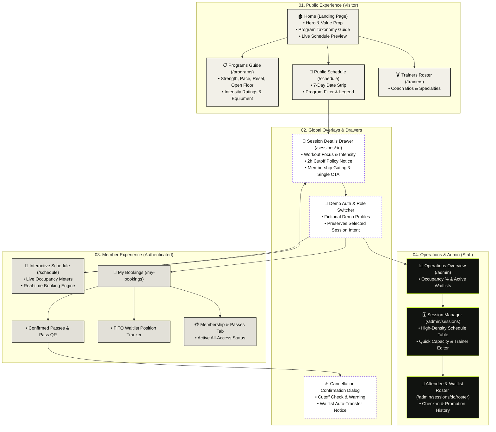
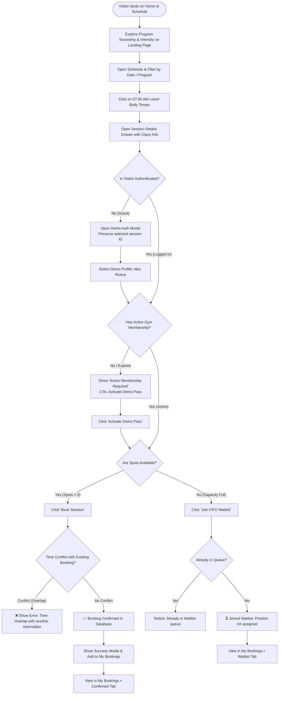
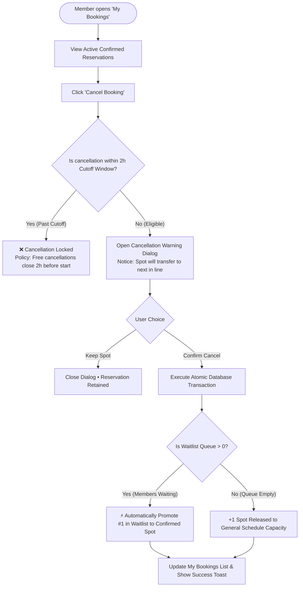
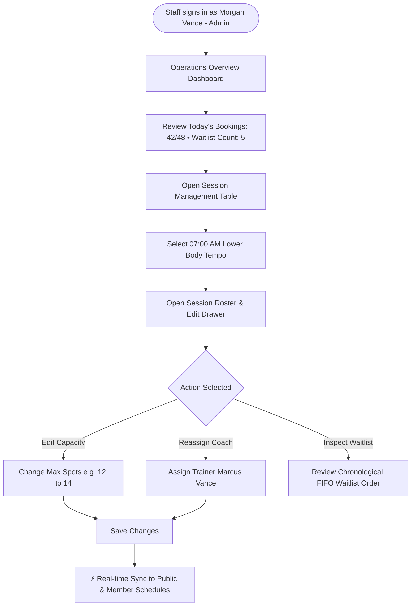

# FitOps UX & User Flow Specification

## Experience Principle

The design must make the next action obvious, expose real product state, and eliminate hidden friction. Visual polish supports the athletic workflow; it does not replace it.

---

## 1. Information Architecture & Sitemap

---

## 2. Critical User Flows

### Flow 1: Visitor Discovery $\rightarrow$ Auth $\rightarrow$ Membership $\rightarrow$ Booking / Waitlist

Addresses first-time visitor program education, context-preserving authentication, gym membership gating, and deterministic FIFO waitlist assignment.

---

### Flow 2: Reservation Cancellation & Automatic FIFO Waitlist Promotion

Proves server-side transactional integrity, 2-hour cancellation cutoff enforcement, and automatic promotion of the next eligible waitlisted member.

---

### Flow 3: Administrator Schedule & Roster Operations

Allows gym staff to monitor real-time occupancy, edit capacity limits, reassign coaches, and review chronological waitlists.

---

## 3. Required Page States

Every interactive page must design these states before implementation:

- **Loading**: Skeleton pulse placeholders matching component dimensions.
- **Empty**: Informative empty states (e.g. *"No sessions scheduled on this date"*, *"You have no active reservations"*).
- **Ready**: Complete interactive loaded state.
- **Validation Error**: In-line field validation and conflict notices (e.g., time overlap).
- **Authorization Failure**: Role-gated redirect or prompt (e.g. member attempting to access `/admin`).
- **Server Failure**: Resilient retry banner with actionable guidance.
- **Success Confirmation**: Toast or modal confirmation for booked, waitlisted, and cancelled sessions.
- **Mobile Layout**: Responsive single-column layout optimized for 390px viewports.

---

## 4. Program Taxonomy & Offer Pillars

- **`[STRENGTH]`**: Heavy compound lifting, tempo intervals, 50 min.
- **`[PACE]`**: Aerobic conditioning, ergometer intervals, 45 min.
- **`[RESET]`**: Mobility, breathwork, myofascial recovery, 45 min.
- **`[OPEN FLOOR]`**: Self-directed athletic training with staff supervision.

---

## 5. Visual Artifact Exports

Stand-alone export files are stored in `docs/design/`:
- `docs/design/sitemap.mmd` & `docs/design/sitemap.svg`
- `docs/design/user-flow-booking.mmd` & `docs/design/user-flow-booking.svg`
- `docs/design/user-flow-cancellation.mmd` & `docs/design/user-flow-cancellation.svg`
- `docs/design/user-flow-admin.mmd` & `docs/design/user-flow-admin.svg`
