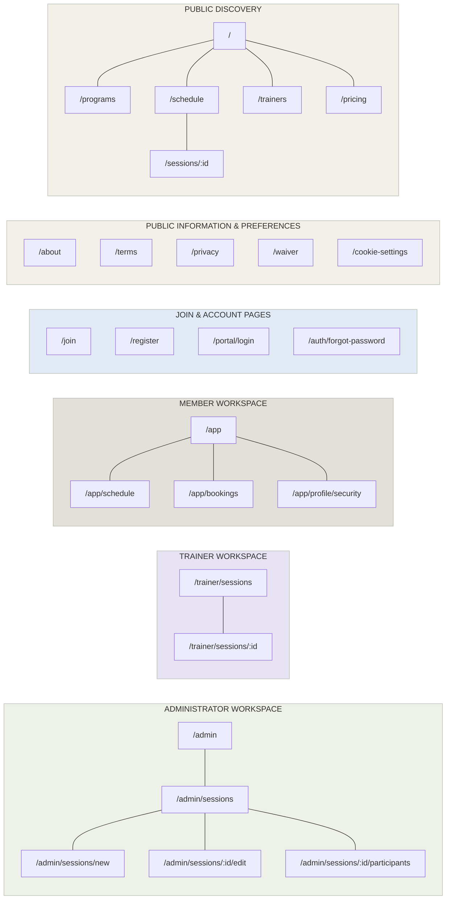
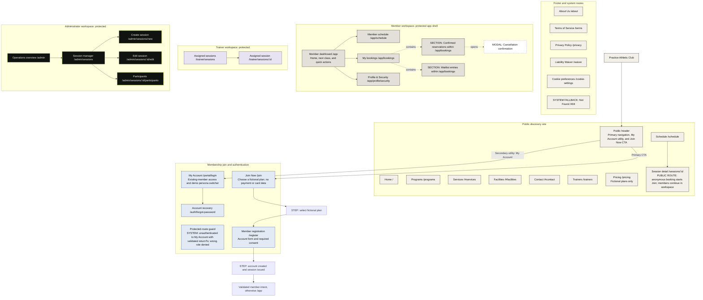
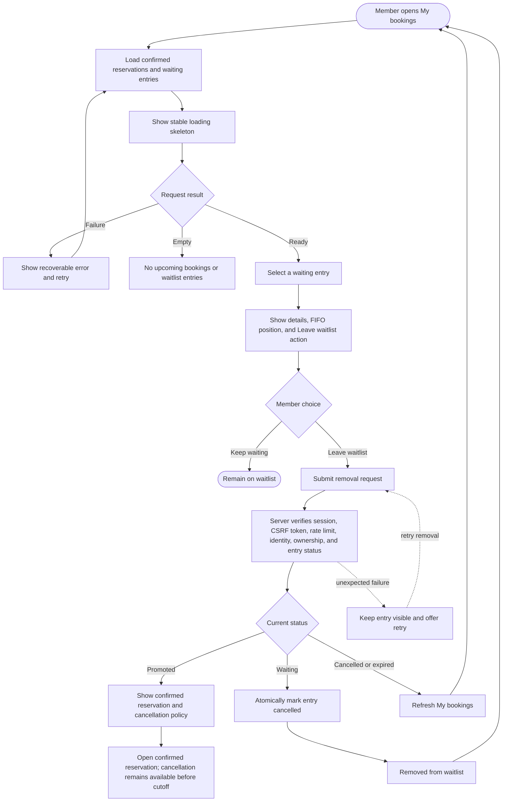
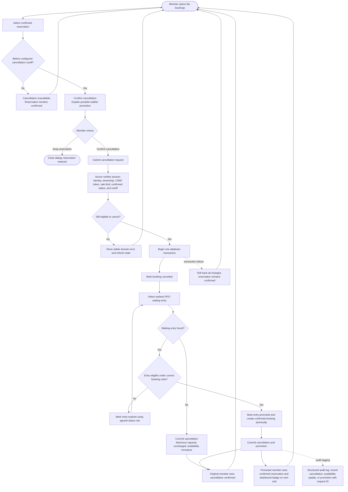
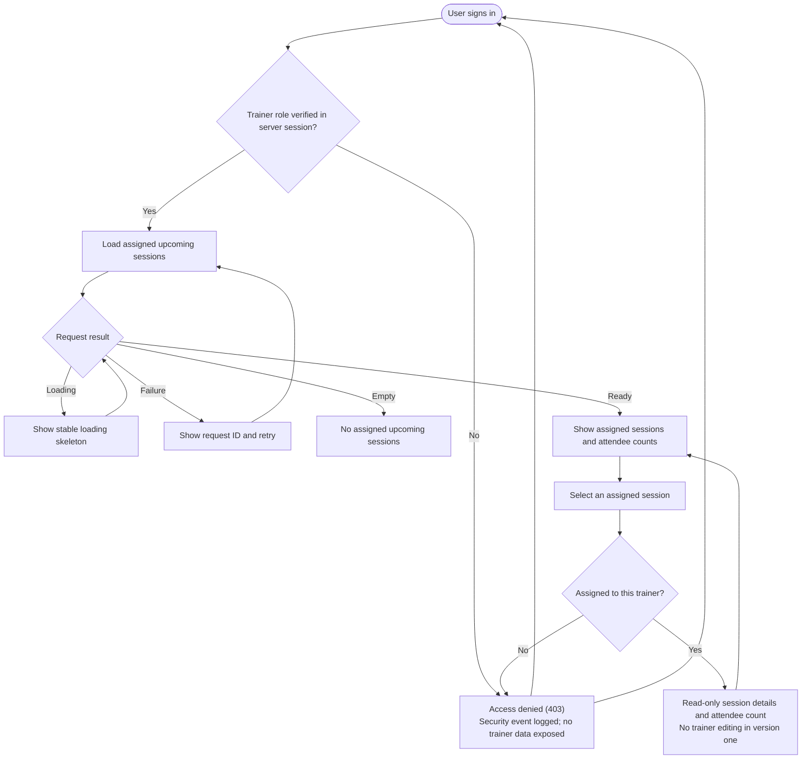
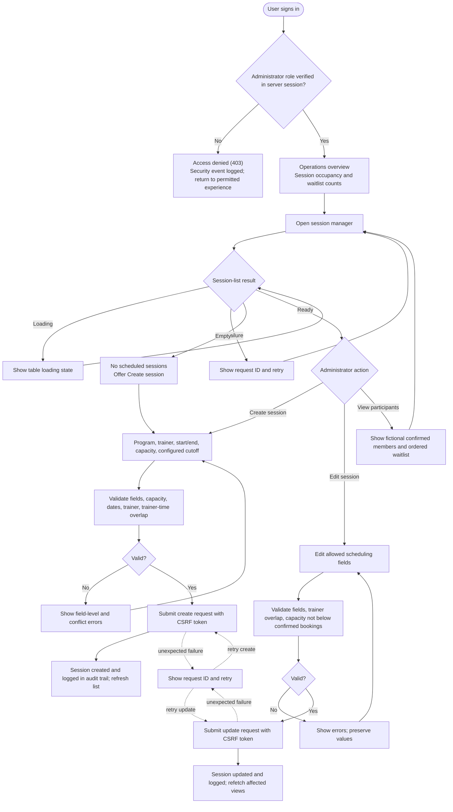
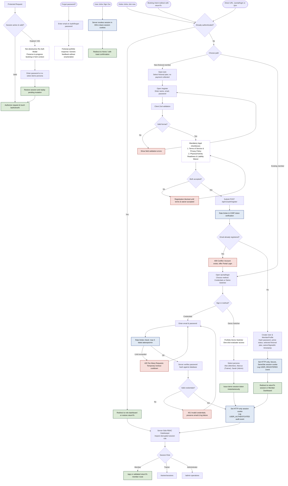

# FitOps User Flows

This note is the Obsidian-readable review hub for the platform user flows, incorporating terms of service, gym liability waiver, privacy policies, demo data governance, security guardrails, and full authentication/onboarding lifecycles.

Open the native editable diagram: [[FitOps User Flows.drawio|FitOps User Flows.drawio]]. The native file now has nine pages: `00 Sitemap` contains 26 page URLs only; `01 Route & Access Architecture` preserves route/access context, explicitly typed UI/system states, and enrollment steps; Pages 02 through 07 retain the detailed flows; Page 08 specifies wireframe sections and scenarios. Landing anchors and the `/404` fallback belong to the architecture view, not the page-only sitemap. No routes or product capabilities were added.

## Native flow correction passes, 2026-09-21

The editable draw.io source was corrected before its Mermaid and Figma derivatives. The sitemap resolves a 70 px collision with the Legend card, maintains taxonomy compliance, and eliminates unauthenticated direct root edges to protected workspaces. The later access-boundary pass implements ADR 006: the public header now offers secondary `My Account` access for existing members and primary `Join Now` conversion; registration is reachable only after fictional-plan selection. Footer/system routes are grouped separately, and protected-route redirects preserve only validated internal `returnTo` state. The detailed flows include recovery for dismissed waivers, expired sessions, duplicate/conflict outcomes, retries, cancellation cutoffs, promotion visibility, forbidden staff access, failed administrator saves, registration consent, existing-email redirects, invalid credentials, and rate limits.

## Visual language and color legend

Every color in the diagrams has a precise architectural meaning derived from the Practice Athletic Club design system and application access model:

| Block Color & Styling | Category / Experience | Architectural Meaning & Scope |
| :--- | :--- | :--- |
| **Cream (`#F2F0E8`)** with Jet Black border | **Public & Legal Experience** | Unauthenticated visitor access: Home, Programs, Schedule, Pricing, Terms of Service, Privacy Policy, Liability Waiver. No credentials required. |
| **Sand (`#E2E0D8`)** with Jet Black border | **Member Space (Protected)** | Authenticated member workspace: `/app`, `/app/schedule`, `/app/bookings`, confirmed reservations, waitlist positions, and `/app/profile/security`. Requires a valid member session. |
| **Soft Blue (`#E1EAF5`)** with Navy border (`#1E3A8A`) | **Join, Auth & Security Hub** | Fictional plan selection, existing-member Sign In, registration, password recovery, CSRF validation, and IP/account rate limiting. No payment is collected. |
| **White Card (`#FFFFFF`)** with Dashed Violet border (`#8B5CF6`) | **Contextual Overlays & Modals** | Ephemeral client dialogs: Cookie/Demo notice banner, Session Details sheet, Join decision, Liability Waiver signing modal, 401 Session Expiry recovery. |
| **Lavender (`#E8E3F3`)** with Deep Purple border (`#4C3B73`) | **Trainer Space (Protected)** | Staff trainer view: Assigned class schedule, attendee counts, session details. Restricted strictly to `TRAINER` role (read-only). |
| **Jet Black (`#111310`)** with Signal Lime border (`#C7F134`) | **Administrator Operations** | Staff operations management: Operations overview, class creation/editing, capacity overrides, participant roster. Restricted strictly to `ADMIN` role. |
| **Soft Sage Green (`#DDEBD8`)** with Forest Green border (`#1F4D32`) | **Success & Confirmed States** | Positive outcomes: Atomic confirmed reservation created, spot opened, FIFO waitlist promotion executed, signed waiver on file. |
| **Soft Alert Red (`#F7DFDC`)** with Crimson border (`#9E2E25`) | **Rejections & Error Gates** | Guard blocks: Cutoff window passed, session capacity full, booking overlap conflict, rate limit lockout (429), 401 expired, 403 forbidden. |
| **Amber Rhombus (`#FFF4D6`)** with Brown border (`#7A4B00`) | **Decision Gateways** | Authoritative conditional logic: Capacity check, membership status, waiver signed?, role eligibility, duplicate prevention. |
| **Solid Grey Connector (`#40443F`)** | **Synchronous Flow / Route** | Standard hierarchical page navigation or authoritative sequential execution step. |
| **Dashed Purple Connector (`#8B5CF6`)** | **Overlay / Modal Trigger** | Non-blocking client dialog activation or contextual sheet presentation. |
| **Dashed Red Connector (`#9E2E25`)** | **Security / Auth Intercept** | Unauthenticated action redirect, rate-limit lockout, or session expiry re-auth recovery. |

## Complete wireframe coverage

The plugin now defines 26 page routes plus a separate 404 fallback, each with full desktop (1440 px) and mobile (390 px) sections. It generates 163 scenarios per device across 27 separate versioned Figma route pages. Desktop/mobile scenario frames are direct children of their page. Only different-frame, same-page transitions receive NAVIGATE reactions; cross-page destinations are labeled and reached through the plugin page chooser. The earlier combined-page run failed native reaction validation; the stricter local regression tests now pass, but native rerun and visual QA remain pending.

[Route, section, and state matrix](../../../docs/design/wireframe-coverage.md).

## Sitemap

[Open SVG preview](../../../docs/design/sitemap.svg). Only page URLs appear as nodes; lines express information hierarchy.

## Route & Access Architecture

[Open SVG preview](../../../docs/design/route-access-architecture.svg). Routes, flow steps, and UI/system behavior are explicitly distinguished.

## Booking and waitlist entry

```mermaid
flowchart TD
    Start([Visitor or member opens schedule]) --> Browse["Filter by date, program, trainer, and availability"]
    Browse --> Results{Any matching sessions?}
    Results -- No --> Empty["Empty state<br/>Clear filters or choose another date"] --> Browse
    Results -- Yes --> Select[Select a session] --> Details["View time, trainer, availability, status, and configured cutoff"]
    Details -. booking terms .-> TermsNotice["Booking terms: Late cancellation forfeits spot; auto-promotion is binding"]
    Details --> Intent[Choose Book session]
    Intent --> Auth{Authenticated?}
    Auth -- No --> Join["Redirect to Join /join<br/>Select a fictional plan or use Portal Login; preserve returnTo"] --> MemberProfile
    Auth -- Yes --> MemberProfile{Has member profile?}
    MemberProfile -- No --> RoleBlocked["Member-only action unavailable<br/>Trainer or admin needs member profile"]
    MemberProfile -- Yes --> Membership{Membership active?}
    Membership -- No --> Inactive["Booking blocked<br/>Inactive membership"]
    Membership -- Yes --> WaiverCheck{Liability waiver signed on file?}
    WaiverCheck -- No --> WaiverModal["Present Liability Waiver and PAR-Q modal<br/>Member signs and acknowledges health release"]
    WaiverModal -- Sign --> StoreWaiver["Store timestamped waiver in profile"] --> SessionEligible
    WaiverModal -- Decline or close --> Details
    WaiverCheck -- Yes --> SessionEligible{Scheduled and before configured cutoff?}
    SessionEligible -- No --> CutoffOrStatus["Booking unavailable<br/>Show status or cutoff passed"] --> Browse
    SessionEligible -- Yes --> SubmitBooking[Submit booking request]
    SubmitBooking --> SecCheck["Security guard: Verify CSRF token, session token, and rate limit"]
    SecCheck -. 401 session expired .-> ExpiryReauth["Session expired modal<br/>Prompt re-auth; preserve session and intent"] -. resume .-> SubmitBooking
    SecCheck -- Valid --> Transaction["Server transaction rechecks identity, membership, waiver, status, cutoff, duplicates, overlap, and capacity"]
    Transaction --> ExistingBooking{Already confirmed?}
    ExistingBooking -- Yes --> AlreadyBooked["Show existing reservation<br/>No duplicate created"] --> MyBookings["Open My bookings /app/bookings"]
    ExistingBooking -- No --> ExistingWaitlist{Already waiting?}
    ExistingWaitlist -- Yes --> AlreadyWaiting["Show current waitlist position<br/>No duplicate created"] --> MyBookings
    ExistingWaitlist -- No --> Overlap{Overlaps another booking?}
    Overlap -- Yes --> Conflict["Show booking conflict"] --> MyBookings
    Overlap -- No --> Capacity{Capacity available at commit time?}
    Capacity -- Yes --> Confirm[Create confirmed booking atomically] --> BookingSuccess["Booking confirmed<br/>Show in My bookings"] --> MyBookings
    Capacity -- No --> Full["Session full<br/>Offer Join waitlist"] --> JoinChoice{Join waitlist?}
    JoinChoice -- No --> Details
    JoinChoice -- Yes --> SubmitWaitlist[Submit waitlist request]
    SubmitWaitlist --> WaitlistSec["Security guard: CSRF and rate limit check"] --> WaitlistRecheck["Server rechecks eligibility, duplicate entry, and capacity"]
    WaitlistRecheck --> StillFull{Session still full?}
    StillFull -- No --> SpotOpened["Refresh and offer booking"] --> Details
    StillFull -- Yes --> CreateEntry[Create one FIFO entry] --> WaitlistSuccess["Waitlist joined<br/>Show current position"] --> MyBookings
    Transaction -. unexpected failure .-> Failure["Preserve context, show request ID, offer retry"]
    WaitlistRecheck -. unexpected failure .-> Failure
    Failure -. retry booking .-> SubmitBooking
    Failure -. retry waitlist .-> SubmitWaitlist
```

## Waitlist management

## Cancellation and FIFO promotion

## Trainer access

## Administrator operations

## Authentication, onboarding, and security

---

## Architectural & Cross-Flow Specifications

### 1. Terms of Service, Gym Liability Waiver & Booking Rules
- **Terms of Service (`/terms`)**: Defines member code of conduct, class check-in policies, booking windows, and cancellation rules based on per-session configured cutoffs.
- **Physical Activity Readiness & Liability Waiver (`/waiver`)**: Required for all athletic club participants. Acknowledges physical risks, confirms readiness to exercise, and releases the club from liability. Checked server-side on every booking request; prompted via modal if not signed.
- **Booking Rules**: A member may not hold concurrent overlapping bookings, duplicate bookings for the same session, or book after the session's configured cutoff has elapsed. Waitlist auto-promotions are transactionally binding.

### 2. Privacy, Cookie Policy & Demo Data Disclosures
- **Privacy Policy (`/privacy`)**: Details minimal personal data storage (fictional name, email, booking timestamps) and session cookie handling.
- **Portfolio Demo Disclosure**: Persistent banner on public views certifying that Practice Athletic Club is a portfolio demonstration using exclusively synthetic, privacy-safe records. No real health, personal identity, or credit card information is collected or processed.
- **Essential Cookie Notice**: Discloses use of secure, HTTP-only Auth.js session cookies and local storage for display preferences.

### 3. Security Architecture & Threat Defenses
- **Session Management**: Auth.js with encrypted, HTTP-only, SameSite=Lax cookies. Session timeout and idle expiry trigger non-destructive re-auth modals preserving user context (`returnTo`).
- **Server-Side RBAC**: Role invariants (`VISITOR`, `MEMBER`, `TRAINER`, `ADMINISTRATOR`) are enforced at the API route handler and middleware level. Unauthorized requests return `403 Forbidden` with zero data leakage.
- **CSRF & Rate Limiting**: All mutations (`POST`, `DELETE`, `PATCH`) validate anti-CSRF headers. Rate limiting is applied to authentication endpoints (preventing brute force credential attacks) and booking endpoints (preventing slot-sniping automated scripts).
- **Structured Audit Logging**: Security events (failed logins, lockout triggers, unauthorized access attempts) and critical operational mutations (cancellations, promotions, admin session edits) are logged with request IDs and sanitized identifiers.
